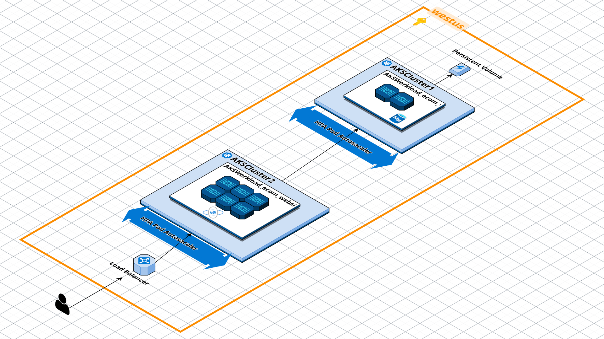

# Azure Kubernetes Resume Challenge

## Introduction

This is a high-level architecture of the Ecommerce Web Application deployed in Azure Kubernetes Service (AKS) by following a *build specification* specified in the [Kubernetes Resume Challenge - KRC](https://cloudresumechallenge.dev/docs/extensions/kubernetes-challenge/). 

### Mods

- Terraform to automate the infrastructure deployment of Kubernetes Cluster.
- Automate Infrastructure provisionioning Kubernetes Cluster with Terraform

### Future Mods

- Introduce **Karpenter** to dynamically scale the Kubernetes cluster based on demand.
- Leverage **Podman** to run a daemonless container engine and improve security because it runs a rootless container.



## Setup

## Prerequisites

1. Configure [az cli](https://learn.microsoft.com/en-us/cli/azure/install-azure-cli-linux?pivots=apt).
2. Install [Docker Desktop](https://docs.docker.com/desktop/setup/install/windows-install/).
3. Install [Terraform](https://learn.microsoft.com/en-us/azure/developer/terraform/quickstart-configure).
4. [Challenge prerequisites](https://cloudresumechallenge.dev/docs/extensions/kubernetes-challenge/#challenge-guide).

## Getting Started

1. Setup Azure storage as the backend for `*.tfstate` file.

    - Traverse to `infra/prerequisites` dir. 
    - Run `terraform apply -auto-approve` 

2. [Install and configure Kubernetes using Terraform](https://learn.microsoft.com/en-us/azure/aks/learn/quick-kubernetes-deploy-terraform?pivots=development-environment-azure-cli)

    - Traverse to `infra` dir.
    - Run `Terraform apply --auto-approve`

3. Build & Deploy the K8s Manifest file for ecommerce webapp and database.

    This will run all the manifests file:
    - `kubectl apply -f k8s/ecom-db/`
    - `kubectl apply -f k8s/ecom-webapp/`

4. Check the newly created pods.

    - `kubectl get pods`

5. Access the ecommerce website by checking the `external-ip` of the `web-service`

    - `kubectl get service`
    - `http://<external-ip>:<port>`

    
    
## Package the E-commerce webapp with Helm

### Install Helm

1. [From script](https://helm.sh/docs/intro/install/#from-script).
2. Intialse the project directory `helm create ecom-webchart`

This will create the correct `dir` structure for helm charts:

```bash
├── Chart.yaml
├── charts
├── templates
│   ├── NOTES.txt
│   ├── _helpers.tpl
│   ├── deployment.yaml
│   ├── hpa.yaml
│   ├── ingress.yaml
│   ├── service.yaml
│   ├── serviceaccount.yaml
│   └── tests
│       └── test-connection.yaml
└── values.yaml
```

In this case I've removed everything from the `templates/` dir and just moved all my manifests file here then converted them into helm templates and parameters for the ecom-webapp.

3. Helm workflow - typical output that's expected if these templates are formed correctly.

```bash
$ helm lint ecom-web-chart/

==> Linting ecom-web-chart/
[INFO] Chart.yaml: icon is recommended

1 chart(s) linted, 0 chart(s) failed

$ helm template ecom-web-chart/

...
# Source: ecom-web-chart/templates/ecom-webapp/website-hpa.yaml
apiVersion: autoscaling/v2
kind: HorizontalPodAutoscaler
metadata:
  name: website-hpa
  namespace: default
spec:
  scaleTargetRef:
    apiVersion: apps/v1
    kind: Deployment
    name: ecommWebsiteDeployment
  minReplicas: 2
  maxReplicas: 10
  metrics:
  - type: Resource
    resource:
      name: cpu
      target:
        type: Utilization
        averageUtilization: 50

$ helm install release-1 ecom-web-chart/

NAME: release-1
LAST DEPLOYED: Sun Feb  2 16:43:06 2025
NAMESPACE: default
STATUS: deployed
REVISION: 1
TEST SUITE: None

```

4. Check the website after new changes are applied. So, in this instance a banner is deployed to notify users that there's a
**Special Offer**.

